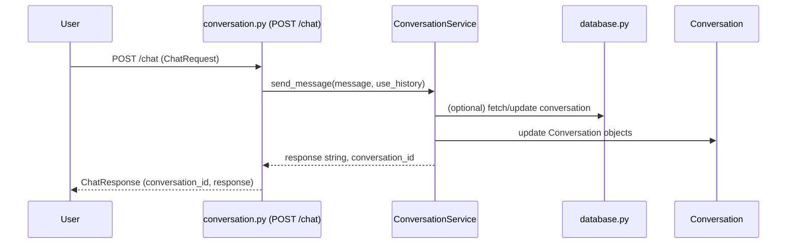
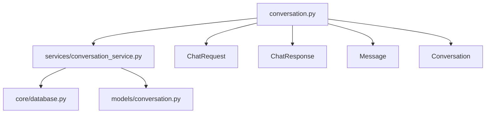

# `conversation.py` — API Endpoint Documentation

## Overview

This module provides FastAPI endpoints for:
- Sending chat messages and receiving responses from the conversation service
- Fetching a list of all past conversations and their details

It defines data models for requests and responses, and delegates business logic to `ConversationService`.

---

## Endpoints

### **POST `/chat`**

**Description:**  
Send a message to the chat service and get a response.

- **Request Body:** [`ChatRequest`](#pydantic-models)
- **Response:** [`ChatResponse`](#pydantic-models)

**Sample Request:**
```json
{
  "message": "Hello, bot!",
  "use_history": true
}
```
**Sample Response:**
```json
{
  "conversation_id": "abc123",
  "response": "Hi there! How can I help you?"
}
```

---

### **GET `/conversations`**

**Description:**  
Retrieve all saved conversations with their messages and metadata.

- **Response:** `List[Conversation]` (see [Pydantic Models](#pydantic-models))

**Sample Response:**
```json
[
  {
    "id": "abc123",
    "messages": [
      {
        "role": "user",
        "content": "Hello, bot!",
        "timestamp": "2025-04-27T14:10:00"
      },
      {
        "role": "bot",
        "content": "Hi there! How can I help you?",
        "timestamp": "2025-04-27T14:10:01"
      }
    ],
    "metadata": {
      "timestamp": "2025-04-27T14:10:00",
      "message_count": 2
    }
  }
]
```

---

## Pydantic Models

- **ChatRequest**
  - `message: str`
  - `use_history: bool = True`

- **ChatResponse**
  - `conversation_id: str`
  - `response: str`

- **Message**
  - `role: str` (e.g. `"user"` or `"bot"`)
  - `content: str`
  - `timestamp: str`

- **ConversationMetadata**
  - `timestamp: str`
  - `message_count: int`

- **Conversation**
  - `id: str`
  - `messages: List[Message]`
  - `metadata: ConversationMetadata`

---

## Endpoint Workflow



---

## File Relationships



---

## Error Handling

- All exceptions are logged using the `logger` instance.
- Any error triggers an HTTP 500 response with the error details.

---

## Example Usage

### **Send a chat message**
```bash
curl -X POST http://localhost:8000/chat \
    -H "Content-Type: application/json" \
    -d '{"message": "Hello!", "use_history": true}'
```

### **Fetch all conversations**
```bash
curl -X GET http://localhost:8000/conversations
```

---

## Further Reading

- [Project Architecture](./architecture.md)
- [Conversation Service Logic](./service.md) <!-- add if you create this doc -->

---

*Keep this document updated as you add more endpoints, models, or change logic!*