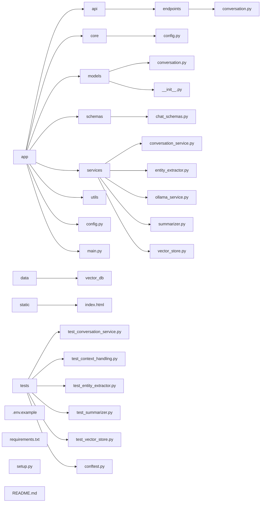

# Project Architecture

## Project Structure

---

## Overview

This project is structured into logical folders for API endpoints, core settings, data models, data schemas, reusable services, utility functions, and test coverage. The data and static directories store your vector database and any static web assets, respectively.

- **app/** – Main application logic and all backend code
    - **api/** – Route definitions and endpoint handlers
    - **core/** – Core settings/configuration and DB connection logic
    - **models/** – Data models used throughout the app
    - **schemas/** – Pydantic schemas for request/response validation
    - **services/** – Reusable services for conversation, entity extraction, summarization, and vector storage
    - **utils/** – Utility/helper functions
    - **main.py** – App entry point
- **data/** – Vector database storage
- **static/** – Static files (HTML, JS, etc.)
- **tests/** – Automated test suite for main features and services
- **.env.example** – Example environment variables for deployment
- **requirements.txt** – Python dependencies
- **setup.py** – Setup script for packaging/installing
- **README.md** – Project overview and quickstart

---

## Further Documentation

- [Conversation API](api/endpoints/conversation.md) — Endpoints, models, and workflow diagrams for chat functionality
- [Config Settings](core/config.md) — Application environment and runtime settings, example usage, and .env layout
- [Conversation Models](models/conversation.md) — Pydantic models for conversations and messages, methods, and class diagrams
- [Chat Schemas](schemas/chat_schemas.md) — Pydantic schemas for chat request/response and message serialization
- [Conversation Service](services/conversation_service.md) — Core business logic for chat, response flow, and aggregation
- [Entity Extractor](services/entity_extractor.md) — NLP pipeline for named entity recognition and intent classification
- [Ollama Service](services/ollama_service.md) — LLM interface for generating AI responses
- [Summarizer](services/summarizer.md) — Text summarization and key point extraction
- [Vector Store](services/vector_store.md) — Semantic vector storage and retrieval for conversations and summaries
- [Main Application](main.md) — FastAPI app entrypoint, routes, and websocket endpoints  

### Test Documentation

- [Conftest](tests/conftest.md) — Project-wide pytest fixtures and service mocking
- [Test Context Handling](tests/test_context_handling.md) — Context extraction, deduplication, and prompt formatting
- [Test Conversation Service](tests/test_conversation_service.md) — Conversation logic, persistence, and conversation analysis
- [Test Entity Extractor](tests/test_entity_extractor.md) — Entity recognition and intent extraction
- [Test Summarizer](tests/test_summarizer.md) — Summarization and key point extraction
- [Test Vector Store](tests/test_vector_store.md) — Chunking, metadata, semantic search, and error handling

