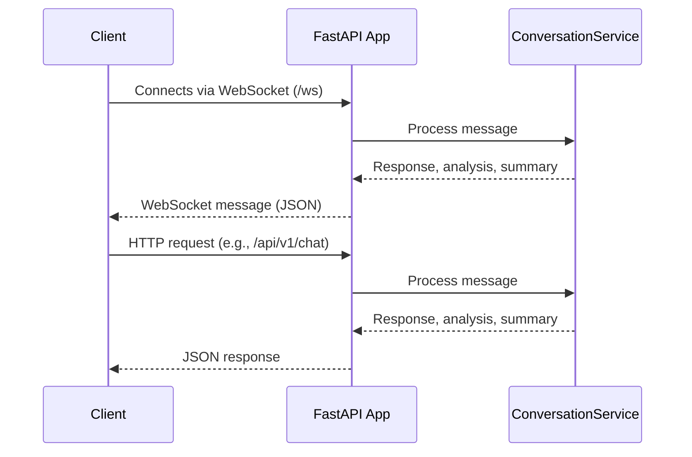

# Main Application (`main.py`)

## Overview

This is the entry point for the FastAPI web application. It manages:
- HTTP endpoints for chat and conversation management
- WebSocket connections for real-time chat
- Initialization of all backend services (conversation, analysis, etc.)
- CORS, static files, and error handling

---

## Features & Endpoints

- **CORS Middleware**: Allows cross-origin requests from any origin
- **Static Files**: Serves frontend (e.g., `index.html`)
- **WebSocket Endpoint** (`/ws`): Real-time, bidirectional communication for chat
- **HTTP API Endpoints:**
    - `GET /api/v1/conversations`: Get all conversations
    - `GET /api/v1/conversations/{conversation_id}`: Get a conversation by ID
    - `POST /api/v1/chat`: Submit a user message and get a response
- **Root Route** (`/`): Serves the frontend client

---

## Key Logic & Flow

1. **Service Initialization**
    - Imports all required services and schemas
    - Instantiates the `ConversationService` singleton
    - Logs success or failure at startup
2. **WebSocket Handling**
    - On connect, accepts the socket
    - Receives messages from the client, processes through the conversation service
    - Returns LLM response, analysis, summary, and conversation ID as JSON
    - Handles disconnects and errors gracefully
3. **API Endpoints**
    - Each endpoint validates service health before processing
    - Handles exceptions with proper HTTP responses and logs

---

## Example Sequence Diagram



---

## Error Handling
- Logs all exceptions and tracebacks
- Returns meaningful error codes (503 for initialization failure, 404/500 for others)

---

## Example Usage

```bash
uvicorn main:app --reload
```

---
