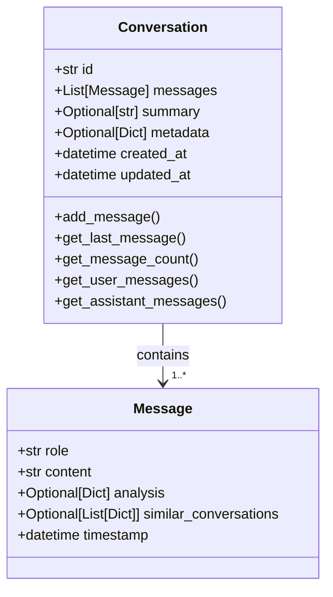

# Conversation Data Models (`models/conversation.py`)

## Overview

This module defines the main data structures for chat conversations in the application, using [Pydantic](https://docs.pydantic.dev/latest/) for type safety and data validation.  
It includes the `Message` and `Conversation` classes, which represent individual messages and entire conversations, respectively.

---

## Models

### Message

Represents a single message within a conversation, with optional analysis and metadata.

| Field                  | Type                  | Default                | Description                              |
|------------------------|-----------------------|------------------------|------------------------------------------|
| role                   | str                   | required               | 'user' or 'assistant'                    |
| content                | str                   | required               | The text content of the message          |
| analysis               | Optional[Dict[str,Any]]| None                   | Optional analysis output for this message|
| similar_conversations  | Optional[List[Dict]]  | None                   | Related conversations (for AI context)   |
| timestamp              | datetime              | Now (UTC)              | Time message was created                 |

**Docstring:**  
> Represents a single message in a conversation

---

### Conversation

Represents an entire conversation, which consists of multiple messages, optional summary, and metadata.

| Field        | Type                      | Default                | Description                                      |
|--------------|---------------------------|------------------------|--------------------------------------------------|
| id           | str                       | required               | Unique identifier for the conversation           |
| messages     | List[Message]             | []                     | List of messages in the conversation             |
| summary      | Optional[str]             | None                   | Summary of the conversation                      |
| metadata     | Optional[Dict[str, Any]]  | None                   | Additional metadata for the conversation         |
| created_at   | datetime                  | Now (UTC)              | When the conversation was created                |
| updated_at   | datetime                  | Now (UTC)              | When the conversation was last updated           |

**Docstring:**  
> Represents a conversation with multiple messages

---

## Conversation Methods

| Method                 | Description                                                         |
|------------------------|---------------------------------------------------------------------|
| add_message(msg)       | Adds a message to the conversation, updates `updated_at`            |
| get_last_message()     | Returns the most recent message, or `None` if empty                 |
| get_message_count()    | Returns the total number of messages in the conversation            |
| get_user_messages()    | Returns a list of all messages from the user                        |
| get_assistant_messages()| Returns a list of all messages from the assistant                  |

---

## Example

```python
from models.conversation import Conversation, Message

msg = Message(role='user', content='Hello!')
conv = Conversation(id='abc123')
conv.add_message(msg)

print(conv.get_message_count())  # 1
print(conv.get_last_message().content)  # "Hello!"
```

---

## Diagram



---


