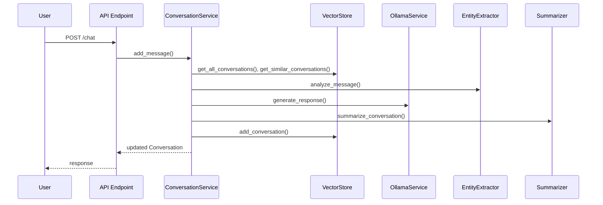

# Conversation Service (`services/conversation_service.py`)

## Overview

The `ConversationService` class orchestrates all business logic for handling conversations, including:
- Creating and managing conversations
- Adding user and assistant messages
- Integrating with the Vector Store, Ollama LLM service, Entity Extraction, and Summarizer modules
- Aggregating entities/intents
- Retrieving and formatting conversations for API responses and storage

---

## Main Methods & Workflow

### `start_new_conversation()`
- Starts and returns a new `Conversation` object with a unique UUID.
- Sets as the current active conversation.

### `add_message(conversation_id, message_content)`
- Validates conversation ID and message content.
- Loads or creates the conversation as needed.
- Uses `EntityExtractor` to analyze entities/intents in the user message.
- Retrieves similar past conversation chunks from the vector store for semantic context.
- Aggregates entities and intents from conversation history.
- Builds a full context prompt for the LLM, including:
    - System instructions
    - Relevant snippets from previous conversations
    - Recent summary and extracted entities/intents
    - Recent conversation history
- Calls `OllamaService` to generate an assistant response.
- Adds the response as an assistant message.
- Summarizes the recent conversation with `Summarizer`.
- Stores the updated conversation in the vector store.
- Returns the updated `Conversation` object.

### `get_all_conversations()`
- Retrieves all conversations from the vector store.
- Converts stored data/chunks into `Conversation` objects with all messages.
- Returns a list of all conversations.

### `aggregate_entities_intents(messages)` (utility function)
- Aggregates entities and intent scores from a list of messages.
- Returns entities grouped by type and averaged intent scores.

---

## Dependencies & Interactions

- **VectorStore**: Stores/retrieves all conversations and provides semantic search.
- **OllamaService**: Handles LLM (large language model) response generation.
- **EntityExtractor**: Extracts entities/intents for richer analysis/context.
- **Summarizer**: Summarizes conversation history.
- **Conversation, Message Models**: Data structures for the chat.

---

## Example Workflow Diagram



---

## Error Handling
- Logs and raises all errors with full tracebacks for debugging.
- Validates input (non-empty IDs, message content, etc.) and raises exceptions for invalid input or not-found conversations.

---

## Logging
- Uses the standard Python `logging` library for all method entry, success, and error events.

---

## Example Usage

```python
service = ConversationService()
conv = service.start_new_conversation()
service.add_message(conv.id, "Hello!")
convs = service.get_all_conversations()
```

---

*Update this file as the service logic changes, or if you add new integrations or business rules!*

