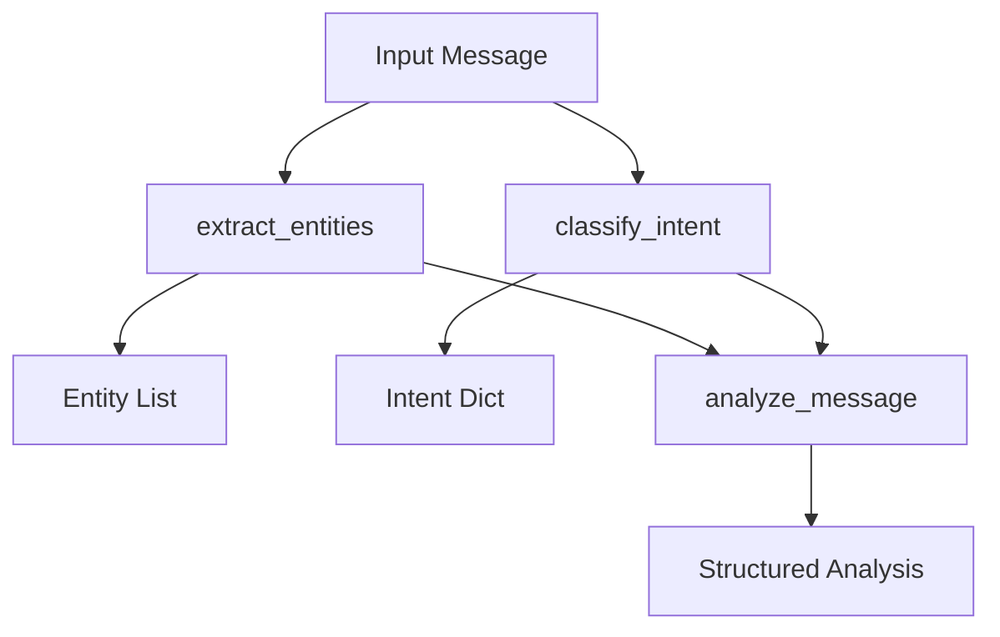

# Entity Extractor (`services/entity_extractor.py`)

## Overview

The `EntityExtractor` class provides advanced natural language processing (NLP) features to:
- Extract named entities (people, places, orgs, etc.) from user messages using both BERT-based and spaCy NER models.
- Classify the intent of a message using zero-shot learning (BART-large-MNLI).
- Aggregate, combine, and structure these entities and intents for use in conversation context and LLM prompts.

It is a key component for building semantic and context-aware chatbots or assistants.

---

## Core Methods & Functionality

### `extract_entities(text: str) -> List[Dict[str, Any]]`
- Runs both a BERT NER pipeline and spaCy NER on input text.
- Combines their outputs, removing duplicates.
- Returns a list of entities, each with label, word, source, and position.

### `classify_intent(text: str) -> Dict[str, float]`
- Uses a zero-shot BART-large-MNLI model to score possible message intents.
- Returns a dict mapping intent labels ("question", "command", etc.) to probabilities.

### `analyze_message(message: str) -> Dict[str, Any]`
- Combines entity extraction and intent classification.
- Returns a structured dict:
    - `entities`: Entities grouped by type
    - `intent`: Scored intents
    - `raw_entities`: All detected entities (BERT + spaCy)

### `aggregate_session_entities_intents(messages: List[Dict]) -> Dict[str, Any]`
- Utility to aggregate entities and intent scores across a session/conversation.
- Returns grouped entities and averaged intent probabilities.

---

## Dependencies

- **HuggingFace transformers** (`pipeline`) for BERT NER and zero-shot intent classification.
- **spaCy** for additional entity recognition.
- **torch** for hardware acceleration.

---

## Example Usage

```python
extractor = EntityExtractor()
entities = extractor.extract_entities("Paris is the capital of France.")
intent = extractor.classify_intent("Book a flight to Paris.")
analysis = extractor.analyze_message("Can you tell me about Tesla stock?")
```

---

## Example Output Structure

```json
{
  "entities": {"ORG": ["Tesla"]},
  "intent": {"question": 0.92, "statement": 0.08},
  "raw_entities": [
    {"entity": "ORG", "word": "Tesla", "source": "bert", ...}
  ]
}
```

---

## Error Handling & Logging
- Logs all initialization, method calls, and errors.
- Checks for empty/invalid input in `classify_intent`.

---

## Diagram



---
