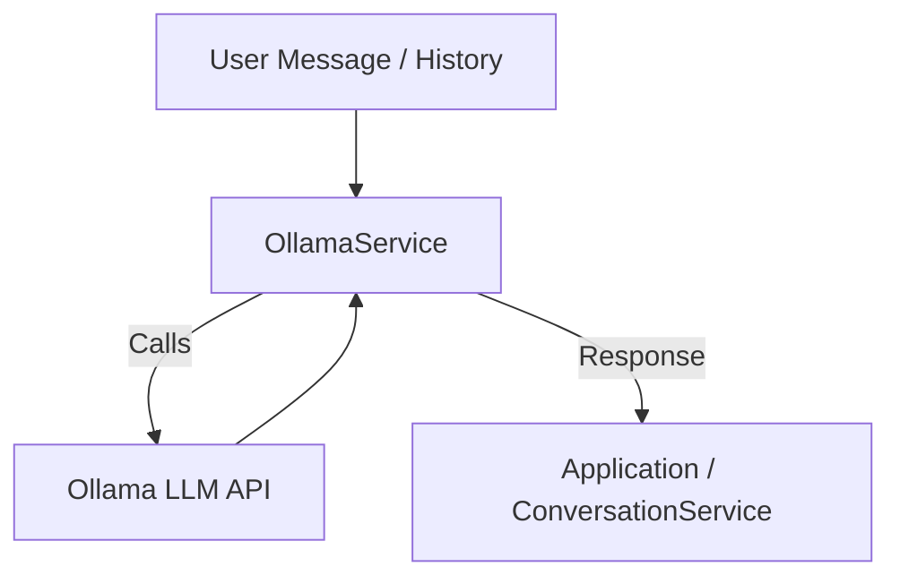

# Ollama Service (`services/ollama_service.py`)

## Overview

The `OllamaService` class acts as an interface between your application and the Ollama large language model (LLM) API. It provides methods to:
- Generate AI responses given user messages and conversation history
- List available models in your local Ollama environment
- Switch between models for different contexts or tasks

---

## Main Methods & Functionality

### `generate_response(message, conversation_history=None, system_prompt=None, extra_context=None) -> str`
- Constructs a context-aware message payload for the Ollama LLM (system, context, history, user input)
- Sends the message(s) to Ollama and retrieves the model’s response
- Handles a variety of response formats robustly
- Raises exceptions and logs details on error

### `list_available_models() -> List[str]`
- Calls Ollama’s model listing API to return available model names
- Logs and returns an empty list on error

### `set_model(model: str)`
- Sets the active model to use for future generations
- Logs the model switch

---

## Dependencies & Configuration
- **Ollama Python client** (`ollama`)
- Reads `OLLAMA_BASE_URL` from global settings (configurable in your `.env` file)

---

## Example Usage

```python
ollama_service = OllamaService(model="llama3")
response = ollama_service.generate_response(
    message="Summarize this meeting.",
    conversation_history=[{"role": "user", "content": "What was decided last time?"}]
)
models = ollama_service.list_available_models()
ollama_service.set_model("mistral")
```

---

## Error Handling & Logging
- All methods log debug and error messages
- Robust extraction from potentially inconsistent API response objects
- Raises descriptive exceptions on generation errors

---

## Workflow Diagram



---


