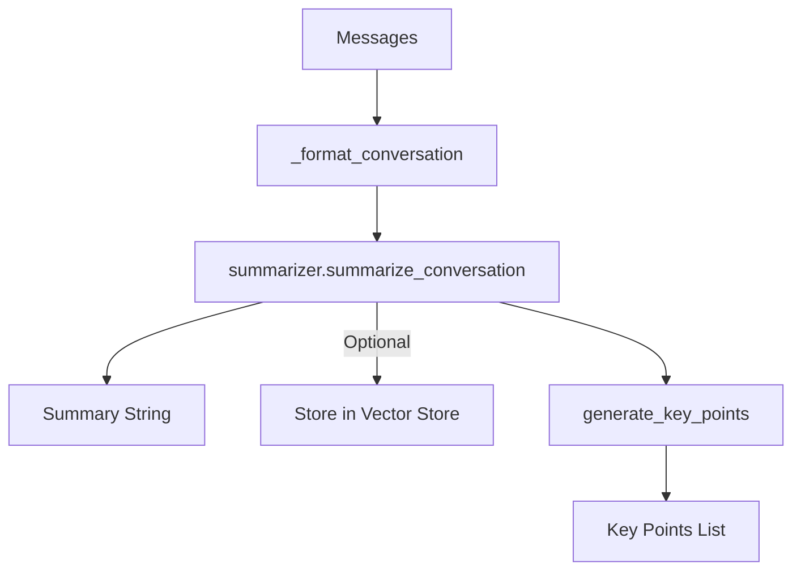

# Summarizer (`services/summarizer.py`)

## Overview

The `Summarizer` class generates concise summaries and key points from chat conversations. It leverages a pre-trained HuggingFace text summarization model and optionally interacts with a vector store to persist summaries and metadata.

---

## Main Methods & Functionality

### `summarize_conversation(messages: List[Dict[str, Any]]) -> str`
- Converts a list of message dicts into readable conversation text.
- Generates a summary using a Transformers summarization pipeline (e.g., "Falconsai/text_summarization").
- Optionally stores the summary in the vector store, along with metadata (conversation ID, timestamp, analysis).
- Returns the generated summary string.

### `generate_key_points(messages: List[Dict[str, Any]], num_points=3) -> List[str]`
- Summarizes the conversation and splits the summary into bullet-point key takeaways.
- Returns the top `num_points` key points as a list of strings.

### `_format_conversation(messages: List[Dict[str, Any]]) -> str`
- Internal helper to format messages, including roles, content, and optional analysis (entities, intent scores).
- Used for readable summary input to the model.

---

## Dependencies
- **HuggingFace Transformers** (pipeline, AutoTokenizer, AutoModelForSeq2SeqLM)
- **torch** (for hardware acceleration)
- **uuid, json, datetime** (for metadata and serialization)

---

## Example Usage

```python
summarizer = Summarizer()
summary = summarizer.summarize_conversation([
    {"role": "user", "content": "How does this system work?"},
    {"role": "assistant", "content": "It uses AI to answer your questions."}
])
key_points = summarizer.generate_key_points([
    {"role": "user", "content": "Tell me about project X."},
    {"role": "assistant", "content": "Project X does A, B, and C."}
], num_points=2)
```

---

## Example Output

```
Summary: "The conversation explained the system's AI-powered Q&A capabilities and clarified user inquiries."
Key Points:
- "The conversation explained the system's AI-powered Q&A capabilities."
- "It clarified user inquiries."
```

---

## Workflow Diagram



---

## Logging & Error Handling
- Logs errors and warnings if the summarization pipeline or storage fails.
- Returns a default error string on failure.

---

