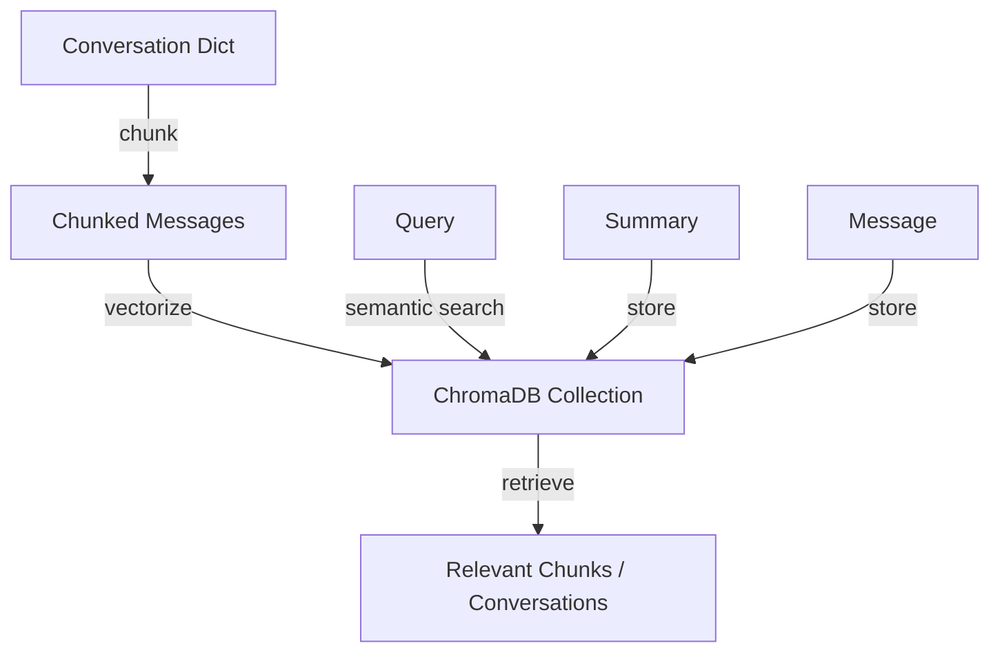

# Vector Store (`services/vector_store.py`)

## Overview

The `VectorStore` class manages all persistent storage and retrieval of conversation data using a vector database (ChromaDB). It enables semantic search, chunked storage, and fast retrieval of conversation histories, messages, and summaries for LLM-powered applications.

---

## Main Responsibilities
- Initialize and manage a persistent vector database with ChromaDB
- Store conversations, messages, and summaries as vectorized documents
- Support semantic search for similar conversations and relevant context
- Chunk messages for efficient retrieval and embedding
- Serialize and deserialize data as needed for storage and retrieval

---

## Key Methods & Workflow

### `add_conversation(conversation)`
- Chunks messages and adds each chunk as a unique document
- Stores summaries as separate documents
- Ensures old/duplicate conversations are safely deleted before adding new ones

### `get_similar_conversations(query, limit=5, min_similarity=0.2)`
- Performs semantic search for conversations similar to a query string
- Aggregates and sorts results by similarity

### `get_all_conversations()`
- Retrieves all conversations with their associated chunks and summaries
- Assembles data into an easy-to-consume structure for use in services/UI

### `store_message(message, metadata=None)`
- Adds a single message as a vectorized document
- Assigns a unique message ID and metadata

### `store_summary(summary, metadata)`
- Persists a conversation summary with required metadata
- Assigns a unique summary ID

### `get_relevant_messages(query, conversation_id=None, limit=5)`
- Retrieves relevant messages from the vector database for a given query (optionally scoped to a conversation)

### `delete_message(message_id)` / `delete_conversation(conversation_id)`
- Deletes individual messages or entire conversations (all messages/summaries) from the vector database

---

## Chunking and IDs
- Pairs user and assistant messages for context-aware chunks
- Chunks are identified by a SHA1 hash of their content
- Summaries and messages get unique UUIDs for robust management

---

## Example Workflow Diagram



---

## Dependencies
- **ChromaDB** (for persistent vector database)
- **transformers** (for tokenization)
- **SentenceTransformers** (for embeddings)
- **NumPy, JSON, datetime, hashlib, logging**

---

## Error Handling & Logging
- Logs errors and stack traces on all failures
- Warns and safely no-ops if the store is not initialized

---

## Example Usage

```python
store = VectorStore()
store.add_conversation(my_conversation_dict)
similar = store.get_similar_conversations("What are embeddings?", limit=3)
all_convs = store.get_all_conversations()
```

---
